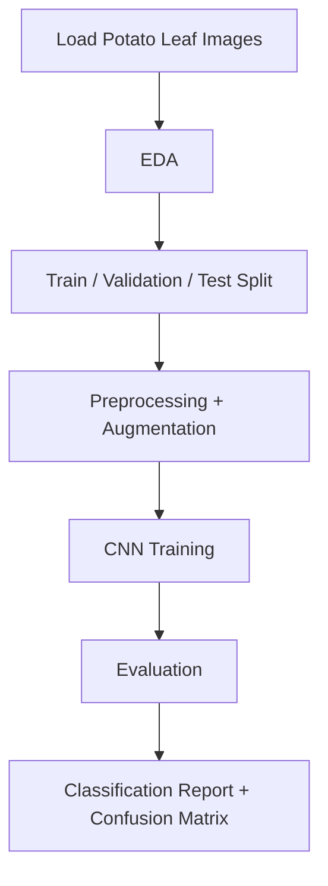

# 🥔 Early Potato Disease Classification

[](./potato.ipynb)
[](https://www.python.org/)
[](https://www.tensorflow.org/)
[](https://colab.research.google.com/github/NipuniK/Early-Potato-Disease-Classification/blob/main/potato.ipynb)

This project builds a **CNN-based image classifier** to detect potato leaf conditions:

- `Potato___Early_blight`
- `Potato___Late_blight`
- `Potato___healthy`

---

## 📚 Table of Contents

- [Project Overview](#-project-overview)
- [Model Performance](#-model-performance)
- [Project Workflow](#-project-workflow)
- [Repository Structure](#-repository-structure)
- [Run the Project](#-run-the-project)
- [Dataset Expectations](#-dataset-expectations)
- [Model Details](#-model-details)
- [Future Improvements](#-future-improvements)

---

## 🔍 Project Overview

The notebook (`potato.ipynb`) covers the full ML pipeline:

1. Load image data with `image_dataset_from_directory`
2. Explore class distribution and image characteristics
3. Split data into train/validation/test sets (80/10/10)
4. Apply normalization + augmentation
5. Train a multi-layer CNN
6. Evaluate using accuracy, confusion matrix, and classification report

<details>
<summary><strong>Why this matters</strong></summary>

Early disease detection helps reduce crop losses and enables timely interventions in agriculture.

</details>

---

## ✅ Model Performance

Final reported test metrics from the notebook:

- **Test Accuracy:** `0.9569`
- **Test Loss:** `0.1416`

| Class | Precision | Recall | F1-score | Support |
|---|---:|---:|---:|---:|
| Potato___Early_blight | 0.97 | 0.97 | 0.97 | 113 |
| Potato___Late_blight | 0.96 | 0.94 | 0.95 | 102 |
| Potato___healthy | 0.84 | 0.94 | 0.89 | 17 |
| **Accuracy** |  |  | **0.96** | **232** |

<details>
<summary><strong>Interpretation</strong></summary>

The model performs strongly overall, with excellent detection of early and late blight classes.  
The healthy class has lower precision, likely because it has fewer samples.

</details>

---

## 🔁 Project Workflow



---

## 🗂 Repository Structure

```text
Early-Potato-Disease-Classification/
├── README.md
└── potato.ipynb
```

---

## 🚀 Run the Project

### Option 1: Open in Google Colab (Quickest)

Click the **Open in Colab** badge at the top of this README.

### Option 2: Run locally

1. Clone the repository
2. Install dependencies
3. Launch Jupyter and run `potato.ipynb`

<details>
<summary><strong>Suggested dependencies</strong></summary>

- tensorflow
- matplotlib
- seaborn
- numpy
- scikit-learn

</details>

---

## 🧪 Dataset Expectations

The notebook expects a directory with one folder per class:

```text
PotatoPlants/
├── Potato___Early_blight/
├── Potato___Late_blight/
└── Potato___healthy/
```

In the notebook, data is loaded from:

```python
"/content/drive/MyDrive/data_set/PotatoPlants"
```

If running locally, update this path accordingly.

---

## 🧠 Model Details

- Input image size: `256 x 256`
- Batch size: `32`
- Epochs: `50`
- CNN stack: multiple `Conv2D + MaxPooling2D` blocks
- Output activation: `softmax`
- Optimizer: `adam`
- Loss: `SparseCategoricalCrossentropy`

---

## 🌱 Future Improvements

- Balance classes or increase healthy-class samples
- Add early stopping and learning-rate scheduling
- Export and serve the model for real-time predictions
- Add a lightweight web/mobile inference interface
